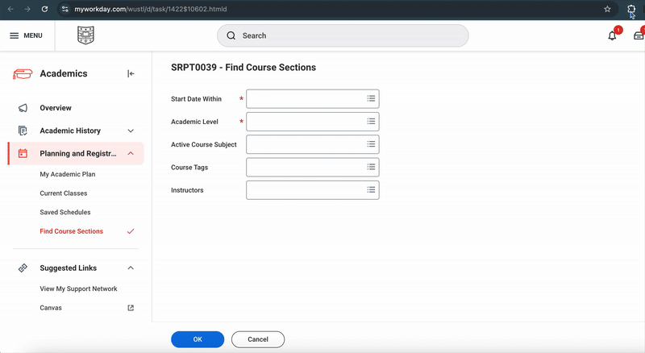

# WashU Workday Extension

**🧑‍🏫RateMyProfessor on Hover:** Displays RateMyProfessors.com information when users hover over professor names on workday's "Find Course Sections" page. It shows a direct link to the professor's rating page, as well as a preview of rate my professor rating and "would take again" rate.

**🏫Semester and Academic Level Selection:** Helps you click through the *tedious* "Find Course Sections" page in just one tap as users can select a specific academic semester (e.g., "Fall 2025") and multiple academic levels (e.g., "Undergraduate", "Graduate") to tailor the automation process. The selections will be saved, so you only need to do it once every semester!

**🎨Theme Customization:** Users can choose from predefined themes (Dark, Blue, Light) or create a "Custom" theme by selecting background & text colors.

Download it through Google Chrome's webstore.

## User's Guide
**Autoclicker:**
Go to "Find Course Sections" on workday, click on the extension, select the semester & academic level, and hit "Run." 

**RMP Popup:**
Once installed (see below for more), the extention should automatically start working once you're on Workday. Hover your mouse over the professor you want to see more about and a window will popup. Click on the name to be directed to the RMP website.

## Installation
### Google Extension Webstore
1. Go to [Workday RMP Helper's page on Google Web Store](https://chromewebstore.google.com/detail/ccfbpchmkcnhfkbidiahfjbkgjhokmok?utm_source=item-share-cb)
2. Click "Add to Chrome"
3. You're all set!

OR

### Git Clone
1. Clone or download this repository.

2. Go to chrome://extensions/ in your Chrome browser.

3. Enable Developer Mode (top right).

4. Click Load unpacked and select the extension folder.

5. Navigate to WashU's Workday or course registration site—hover over a professor’s name to see the popup!

## Author
Developed by Andrew Tian (andrew.tian@wustl.edu) & Alson Yau (a.yau@wustl.edu) — feel free to fork or contribute!
